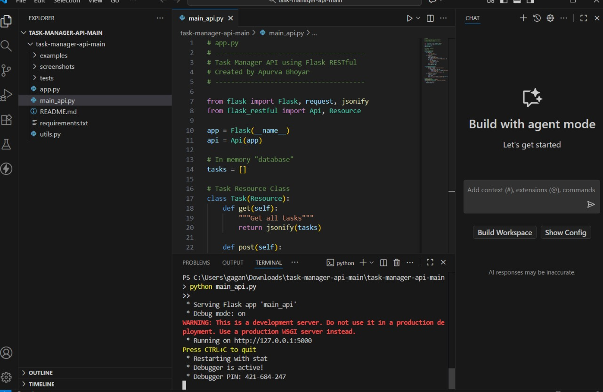
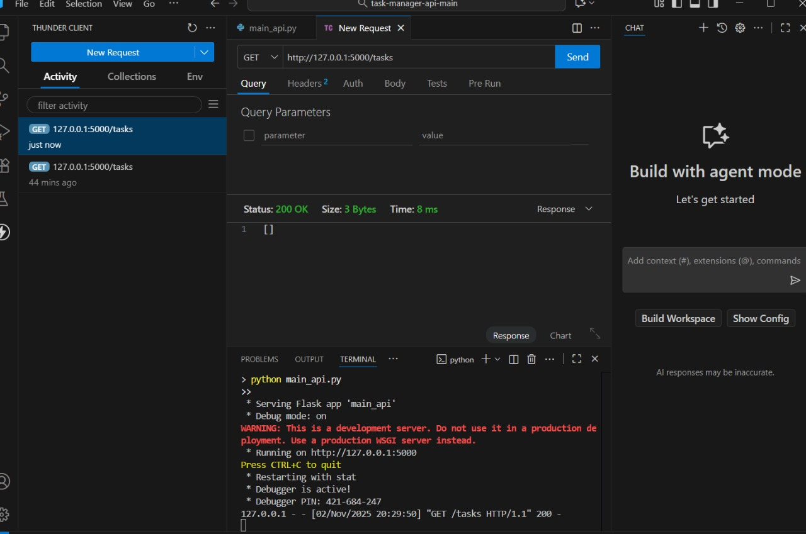
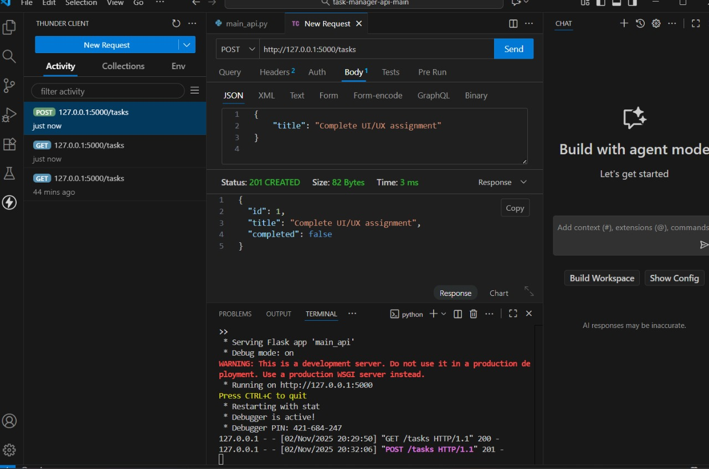
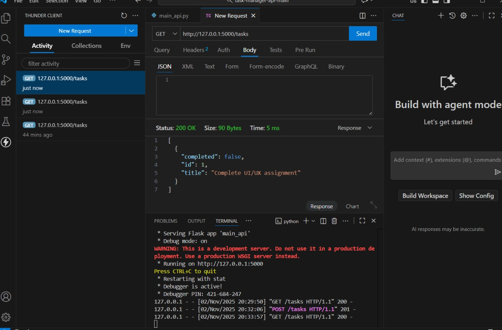

# Task Manager API (Flask)

## 🧠 Project Overview
This project is a simple Task Manager API built using Flask.  
It allows users to perform basic CRUD (Create, Read, Update, Delete) operations on tasks. The API is tested using Thunder Client or Postman to simulate requests.

This project is designed to demonstrate how REST APIs work using Flask.  
It helps in understanding key concepts such as routing, endpoints, HTTP methods, and JSON responses — all essential for backend or full-stack development.


---

## ⚙️ Features
✅ Add new tasks  
✅ Retrieve all tasks  
✅ Mark tasks as complete or incomplete  
✅ View tasks using GET requests  
✅ Simple and lightweight Flask backend


---


## 🔧 Technologies Used
- Python
- Flask
- Thunder Client (for testing APIs)
- VS Code

---

## 📸 Project Screenshots

###  🟢1️⃣ Run Flask Server



###  🟡2️⃣ Initial GET Request (Empty Task List)



###  🔵3️⃣ POST Request (Create Task)


###  🔴4️⃣ GET Request (After Adding Task)

---

## 🚀 How to Run
1. Clone this repository  
   ```bash
   git clone https://github.com/YOUR-USERNAME/YOUR-REPOSITORY-NAME.git

 
2. Install dependencies:
   ```bash
     pip install flask
   ```
   
3. Run the app:
   ```bash
     python main_api.py
   ```

4. Open Thunder Client / Postman
   ```bash
    http://127.0.0.1:5000/tasks
   ```
💼 Author

Apurva Bhoyar

Aspiring Data Analyst & Python Developer


---

### 💻 Commit and push to GitHub

```bash
git add .
git commit -m "Added project screenshots and updated README"
git push origin main

```

## 🔗 API Endpoints


| Method | Endpoint       | Description              |
|--------|----------------|--------------------------|
| GET    | `/tasks`       | Retrieve all tasks       |
| POST   | `/tasks`       | Add a new task           |
| PUT    | `/tasks/<id>`  | Update a task by ID      |
| DELETE | `/tasks/<id>`  | Delete a task by ID      |

### Example Task JSON
```json
{
  "id": 1,
  "title": "Learn Flask",
  "completed": false
}

```
🔮 Future Enhancements

Add user authentication (login/signup)

Connect the API to a real database like SQLite or MySQL

Build a simple frontend using HTML or React to interact with the API

Host the API on Render or Vercel


